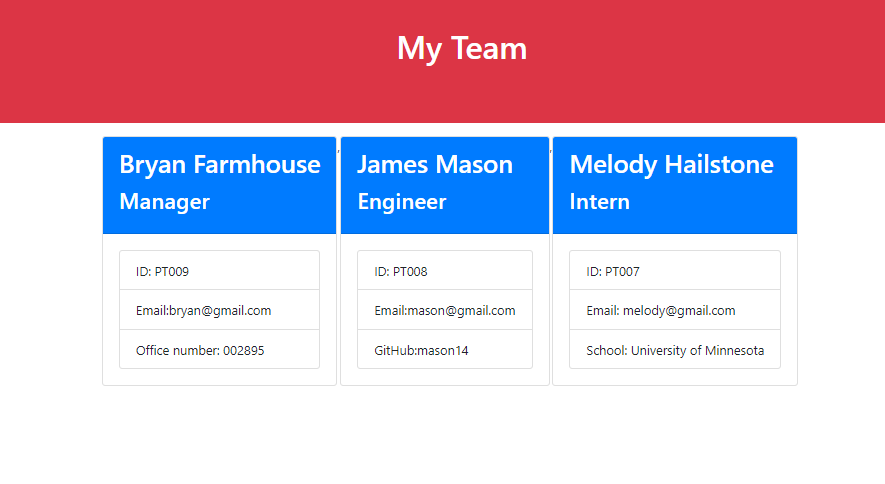

# Team-Profile-Generator

# Description

In this project i buiLt a Node.js command-line application that takes in information about employees on a software engineering team, then generates an HTML webpage that displays summaries for each person.

https://drive.google.com/file/d/1kD3OgS_L0OeHAYggUbTjYNWOZ2ULOol9/view

# Screenshot

# installation

N/A

# usage

N/A

# credit

N/A

# licence

MIT licence
